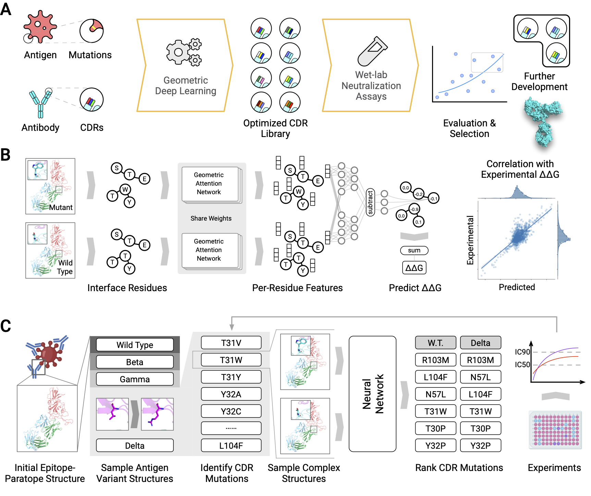

# DDG Predictor



This repository contains the deep learning model introduced in the paper "Deep Learning-Guided Optimization of Human Antibody Against SARS-CoV-2 Variants with Broad Neutralization". It predicts changes in binding energy upon mutation (ddG) for protein-protein complexes.

## Installation

The model is tested with `Python 3.8`, `PyTorch 1.10`, `cudatoolkit 11.3`, and `Biopython 1.79`. The dependencies can be set up using the following commands:

```bash
conda create --name ddg-predict python=3.8 -y
conda activate ddg-predict
conda install pytorch=1.10.2 cudatoolkit=11.3 -c pytorch -y
conda install biopython=1.79 easydict -c conda-forge -y
```

Next, clone this repository by:

```bash
git clone https://github.com/HeliXonProtein/binding-ddg-predictor.git
cd binding-ddg-predictor
```

## Usage

The model requires two input PDB files: (1) a wild-type complex structure, and (2) a mutated complex structure. The mutated structures are typically built by protein design packages such as Rosetta. Note that both structures must have the same length. The ddG can be predicted for the two structures by running the command:

```bash
python ./scripts/predict.py <path-to-wild-type-pdb> <path-to-mutant-pdb>
```

A quick example can be obtained by running:

```
python ./scripts/predict.py ./data/example_wt.pdb ./data/example_mut.pdb
```

## Citation

Coming soon...

## Contact

Please contact luost[at]helixon.com for any questions related to the source code.
